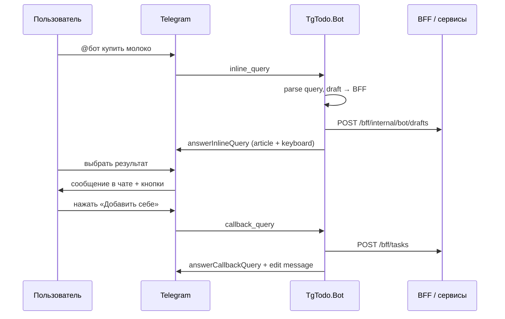

# Telegram Bot — команды MVP и inline-создание задач

Сейчас в репозитории реализованы **Mini App + BFF + микросервисы** и отдельный процесс **`TgTodo.Bot`** (long polling). Все операции бот проксирует в BFF с заголовками `X-TgTodo-Bot-Key` и `X-Telegram-User-Id` (см. `TelegramAuthMiddleware`).

---

## 1. Настройка в BotFather

| Шаг | Команда BotFather | Значение для TgTodo |
|-----|-------------------|---------------------|
| Создать бота | `/newbot` | Имя + username, например `@tgtodo_bot` |
| Описание | `/setdescription` | Задачи и баллы для себя и семьи |
| About | `/setabouttext` | Кратко: Mini App, inline-задачи в чатах |
| Команды | `/setcommands` | Список из раздела 2 (скопировать блок ниже) |
| **Inline mode** | `/setinline` | Включить → placeholder: `Создать задачу…` |
| Mini App URL | `/setmenubutton` или Bot Settings → Menu Button | `https://<ваш-домен>/` (HTTPS) |
| Токен | — | `BOT_TOKEN` в `.env` / compose (уже используется BFF для проверки `initData`) |

### Текст для `/setcommands`

```
start - Старт и ссылка на приложение
app - Открыть Mini App
today - Задачи на сегодня
balance - Личный и групповой баланс
history - История баллов (последние операции)
groups - Мои группы
newgroup - Создать группу (название в следующем сообщении)
join - Вступить по коду: /join ABC123
newtask - Быстрая личная задача
complete - Отметить задачу выполненной (по номеру из /today)
help - Справка по командам
```

---

## 2. Команды бота ↔ функции MVP

Каждая команда должна вызывать тот же сценарий, что и Mini App (см. `docs/OVERVIEW.md`).

| Команда | MVP-функция | BFF / API | Поведение в боте |
|---------|-------------|-----------|------------------|
| `/start` | Вход, профиль | `Identity` ensure user | Приветствие, кнопка Mini App |
| `/start join_КОД` | Вступление (deep link) | `POST /bff/groups/join` | То же, что `/join КОД`, после перехода по `https://t.me/<бот>?start=join_<код>` |
| `/app` | Mini App | URL приложения | Inline-кнопка с `WebAppInfo` |
| `/today` | Задачи на день | `GET /bff/home?groupId=&date=` | Список задач; кнопки ✅ по `taskId` |
| `/balance` | Два счёта | `GET /bff/balance?groupId=` | «Личный: N», «Группа: M» (если выбран контекст) |
| `/history` | Ledger | `GET /bff/ledger?take=50` | Последние 5–10 строк: дата, ±баллы, причина |
| `/groups` | Список групп | `GET /bff/groups` | Имена + invite-код + **ссылка** `https://t.me/<бот>?start=join_<код>`; кнопки контекста |
| `/newgroup` | Создание группы | `POST /bff/groups` | Диалог: название → код приглашения |
| `/join КОД` | Вступление | `POST /bff/groups/join` | 6 символов, латиница/цифры |
| *(контекст)* | Выход / удаление группы | `POST leave`, `DELETE group` | Только в Mini App или `/groups` → inline-меню (owner) |
| `/newtask` | Создание задачи | `POST /bff/tasks` | Мастер или одна строка; см. inline ниже |
| `/complete` | Complete | `POST /bff/tasks/{id}/complete` | После `/today` — callback `complete:{taskId}` |
| Inline `@бот текст` | Создание в чате | `POST /bff/tasks` | Карточка в чате + «Добавить себе» / «Отклонить» |
| — | Повторения | поля `Recurrence`, `Weekday`, … | В боте: флаги `--daily`, `--weekly 3`, `--monthly 15`, `--every 3` или только в Mini App |
| — | Категории | `GET /bff/categories` | Пока только Mini App; в боте — опционально `/categories` |
| — | Исполнитель / видимость | поля create body | Пока дефолты как в Mini App; расширение — `/newtask @user` |

### Контекст «личные / группа»

В Mini App контекст хранится в `AppState.SelectedGroupId`. В боте нужна **сессия пользователя** (Redis / БД):

- `SelectedGroupId` — `null` = личные задачи;
- переключение: inline-кнопки после `/groups` или `/context personal` / `/context <groupId>`.

Все запросы с `groupId` должны совпадать с выбранным контекстом.

### Маппинг «причина» в истории

| `reason` в ledger | Текст в боте |
|-------------------|--------------|
| `task_complete` | Задача выполнена |

---

## 3. Inline-режим: задача в диалоге «как на скрине»

Это режим, когда в **любом чате** (личка, группа, канал с обсуждением) пользователь пишет:

```text
@tgtodo_bot купить молоко +10
```

Telegram показывает подсказки бота; пользователь выбирает результат — в чат уходит сообщение **через @бот** с кнопками.

### 3.1. Что видит пользователь (целевой UX)

```
┌─────────────────────────────────────┐
│  через @tgtodo_bot                  │
│  📋 Задача: купить молоко           │
│                          15:39  ✓✓ │
├─────────────────────────────────────┤
│  🙋 Добавить себе                   │
├─────────────────────────────────────┤
│  ⭕ Отклонить                       │
└─────────────────────────────────────┘
```

- Текст сообщения формирует **бот** (`input_message_content`).
- Подпись «через @…» добавляет **Telegram** автоматически для inline-результатов.
- Кнопки — `inline_keyboard` в том же результате.

### 3.2. Поток данных



**Важно:** до нажатия «Добавить себе» задача **не создана** — в чате только черновик (предложение). Так можно сделать «Отклонить» без записи в БД.

### 3.3. Разбор текста запроса (пример)

Рекомендуемый формат в inline-строке:

```text
@tgtodo_bot <название> [+баллы] [#группа|личная]
```

Примеры:

| Ввод | Title | Points | Scope |
|------|-------|--------|-------|
| `купить молоко` | купить молоко | 10 (дефолт) | личная |
| `уборка +25` | уборка | 25 | личная |
| `уборка +25 #семья` | уборка | 25 | группа «семья» (по имени/коду из сессии) |

Парсер: regex `^(?<title>.+?)(?:\s+\+(?<points>\d+))?(?:\s+#(?<group>\S+))?$`.

### 3.4. `answerInlineQuery` (Telegram Bot API)

Псевдо-JSON одного результата:

```json
{
  "inline_query_id": "<из update>",
  "results": [
    {
      "type": "article",
      "id": "draft-8f3a2c1b",
      "title": "Задача: купить молоко",
      "description": "Личная · +10 баллов · на сегодня",
      "input_message_content": {
        "message_text": "📋 *Задача:* купить молоко",
        "parse_mode": "Markdown"
      },
      "reply_markup": {
        "inline_keyboard": [
          [
            {
              "text": "🙋 Добавить себе",
              "callback_data": "tadd:8f3a2c1b"
            }
          ],
          [
            {
              "text": "⭕ Отклонить",
              "callback_data": "tno:8f3a2c1b"
            }
          ]
        ]
      }
    }
  ],
  "cache_time": 0,
  "is_personal": true
}
```

Ограничения:

- `callback_data` ≤ **64 байта** — используйте короткий `draftId` (GUID без дефисов или ulid).
- Черновик храните **5–15 минут** в **BFF** (`POST/GET/DELETE /bff/internal/bot/drafts`, ключ только `X-TgTodo-Bot-Key`), чтобы пережить рестарт процесса бота. Периодически бот вызывает `POST .../drafts/prune`.

### 3.5. Обработка callback

| `callback_data` | Действие |
|-----------------|----------|
| `tadd:{draftId}` | `GET /bff/internal/bot/drafts/{id}` → `EnsureUser` → `POST /bff/tasks` → удалить черновик → ответ пользователю |
| `tno:{draftId}` | `DELETE /bff/internal/bot/drafts/{id}` → правка сообщения |

Тело создания задачи (как Mini App по умолчанию):

```json
{
  "scope": "Personal",
  "title": "купить молоко",
  "pointsReward": 10,
  "recurrence": "None",
  "personalVisibility": "Private",
  "completionMode": "AnyMember",
  "groupId": null,
  "startDate": "2026-05-19"
}
```

Для **группового чата** можно по умолчанию предлагать общую задачу (`scope: Group`, `groupId` из привязки чата ↔ группа TgTodo) — это отдельная настройка.

### 3.6. Пример на C# (Telegram.Bot)

```csharp
// InlineQuery
bot.OnInlineQuery(async (client, iq, ct) =>
{
    var parsed = InlineTaskParser.Parse(iq.Query);
    if (parsed is null)
    {
        await client.AnswerInlineQuery(iq.Id, [], cancellationToken: ct);
        return;
    }

    var draftId = await drafts.SaveAsync(iq.From.Id, parsed, ct);

    var result = new InlineQueryResultArticle(
        id: draftId,
        title: $"Задача: {parsed.Title}",
        inputMessageContent: new InputTextMessageContent($"📋 *Задача:* {parsed.Title}")
        {
            ParseMode = ParseMode.Markdown
        })
    {
        Description = $"{parsed.ScopeLabel} · +{parsed.Points} баллов",
        ReplyMarkup = new InlineKeyboardMarkup(new[]
        {
            new[] { InlineKeyboardButton.WithCallbackData("🙋 Добавить себе", $"tadd:{draftId}") },
            new[] { InlineKeyboardButton.WithCallbackData("⭕ Отклонить", $"tno:{draftId}") }
        })
    };

    await client.AnswerInlineQuery(iq.Id, new[] { result }, cacheTime: 0, isPersonal: true, cancellationToken: ct);
});

// CallbackQuery
bot.OnCallbackQuery(async (client, cq, ct) =>
{
    if (cq.Data?.StartsWith("tadd:") == true)
    {
        var draftId = cq.Data["tadd:".Length..];
        var draft = await drafts.GetAsync(draftId, ct);
        if (draft is null)
        {
            await client.AnswerCallbackQuery(cq.Id, "Черновик не найден или истёк…", showAlert: true, cancellationToken: ct);
            return;
        }
        if (draft.TelegramUserId != cq.From.Id)
        {
            await client.AnswerCallbackQuery(cq.Id, "Добавить может только автор карточки.", showAlert: true, cancellationToken: ct);
            return;
        }

        await bff.CreateTaskAsync(draft, ct); // POST /bff/tasks от имени пользователя
        await client.AnswerCallbackQuery(cq.Id, "Задача добавлена", cancellationToken: ct);
        await client.EditMessageText(cq.Message!.Chat.Id, cq.Message.MessageId,
            $"✅ Задача добавлена: {draft.Title}", cancellationToken: ct);
        await drafts.DeleteAsync(draftId, ct);
    }
    else if (cq.Data?.StartsWith("tno:") == true)
    {
        await client.AnswerCallbackQuery(cq.Id, cancellationToken: ct);
        await client.EditMessageText(cq.Message!.Chat.Id, cq.Message.MessageId,
            "Задача отклонена", cancellationToken: ct);
    }
});
```

NuGet: `Telegram.Bot` (актуальная v21+).

### 3.7. Webhook, очередь и параллельная обработка

В `TgTodo.Bot` реализовано:

1. **Приём** — long polling или **HTTPS webhook** (`Bot:DeliveryMode`).
2. **Очередь** — по умолчанию в Docker: **RabbitMQ** (`Bot:RabbitMq:HostName=rabbitmq`). Без хоста — in-memory канал. Подробный гайд: **[BOT-RABBITMQ.md](./BOT-RABBITMQ.md)**.
3. **Обработка** — параллельные consumer’ы (RabbitMQ: `MaxConsumerChannels`, in-memory: `MaxParallelUpdateHandlers`).

| Режим | Когда |
|-------|--------|
| **Polling** | Локально, простой Docker без публичного URL бота (`BOT_DELIVERY_MODE` не задан или `Polling`) |
| **Webhook** | Прод: публичный URL на контейнер бота (или reverse proxy), `BOT_DELIVERY_MODE=Webhook`, задать `BOT_WEBHOOK_PUBLIC_BASE_URL` и длинный `BOT_WEBHOOK_SECRET_TOKEN` |

Kestrel слушает **`ASPNETCORE_URLS`** (в compose для бота: `http://+:8080`). Прокси (Caddy/Nginx) должен пробрасывать HTTPS на этот порт и путь webhook.

Бот — проект `src/Bot/TgTodo.Bot` (SDK Web + hosted services). Mini App и бот делят `BOT_TOKEN`; вызовы BFF — заголовки `X-TgTodo-Bot-Key` и `X-Telegram-User-Id`.

### 3.8. Частые ошибки

| Проблема | Решение |
|----------|---------|
| `@бот` не появляется в чате | В BotFather: `/setinline`, подождать ~минуту |
| Нет результатов | Бот должен ответить на **каждый** `inline_query` (хотя бы `[]`) |
| Кнопки не работают | Обрабатывать `callback_query`; токен тот же |
| «Добавить» создаёт задачу другому | Сверять `cq.From.Id` с `draft.TelegramUserId` |
| «Черновик устарел» / нет черновика после редеплоя | Хранить черновики в BFF; TTL `DraftTtlMinutes`; не запускать два инстанса бота на один токен |
| В группе видят все, а задача личная | В описании inline писать «Личная»; в групповом чате опционально second button «В общий список» |

---

## 4. Кнопка Mini App в `/start`

```json
{
  "inline_keyboard": [
    [
      {
        "text": "📱 Открыть TgTodo",
        "web_app": { "url": "https://your-domain.example/" }
      }
    ]
  ]
}
```

Тот же URL, что в BotFather Menu Button.

---

## 5. Реализация в репозитории

| Компонент | Путь |
|-----------|------|
| Worker + Kestrel + handlers | `src/Bot/TgTodo.Bot/` (`Program.cs`, `BotUpdateHandler.cs`) |
| Очередь RabbitMQ | `Services/RabbitMqTelegramUpdateIngress.cs`, гайд `docs/BOT-RABBITMQ.md` |
| In-memory fallback | `Services/ChannelTelegramUpdateIngress.cs`, `UpdateIngestQueue.cs` |
| Long polling (если не Webhook) | `Services/TelegramPollingWorker.cs` |
| Старт: команды + set/delete webhook | `TelegramBotLifecycle.cs` |
| BFF-клиент | `Services/BffClient.cs` |
| Inline-черновики | BFF: `TgTodo.Bff/Services/BotInlineDraftStore.cs`, маршруты `/bff/internal/bot/drafts*` |
| Docker | `docker/Dockerfile.bot`, сервис `bot` в `deploy/docker-compose.yml` |
| Auth бота на BFF | для `/bff/*` (кроме internal drafts): `X-TgTodo-Bot-Key` + `X-Telegram-User-Id` + `X-Telegram-Display-Name` (см. `TelegramAuthMiddleware`) |

### Запуск

**Docker (вместе со стеком):**

```powershell
# deploy/.env: BOT_TOKEN=..., BOT_INTERNAL_KEY=dev-bot-key
# Webhook (опционально): BOT_DELIVERY_MODE=Webhook, BOT_WEBHOOK_PUBLIC_BASE_URL=https://..., BOT_WEBHOOK_SECRET_TOKEN=...
cd deploy
docker compose up -d --build bot
```

**Локально (polling):**

```powershell
$env:BOT_TOKEN = "your_token"
$env:Bot__BffBaseUrl = "http://localhost:5000"
dotnet run --project src/Bot/TgTodo.Bot
```

**Локально (webhook через ngrok):**

```powershell
$env:BOT_TOKEN = "..."
$env:Bot__DeliveryMode = "Webhook"
$env:Bot__WebhookPublicBaseUrl = "https://xxxx.ngrok-free.app"
$env:Bot__WebhookSecretToken = "random-long-secret"
$env:ASPNETCORE_URLS = "http://localhost:8081"
dotnet run --project src/Bot/TgTodo.Bot
```

Убедитесь, что ngrok пробрасывает на тот же порт и путь, что в `Bot:WebhookPath` (по умолчанию `/telegram/webhook`).

В BotFather: `/setinline` → placeholder `Создать задачу…`

---

## 6. Ссылки

- [Telegram Bot API — Inline mode](https://core.telegram.org/bots/inline)
- [answerInlineQuery](https://core.telegram.org/bots/api#answerinlinequery)
- [InlineQueryResultArticle](https://core.telegram.org/bots/api#inlinequeryresultarticle)
- [Mini Apps](https://core.telegram.org/bots/webapps)
